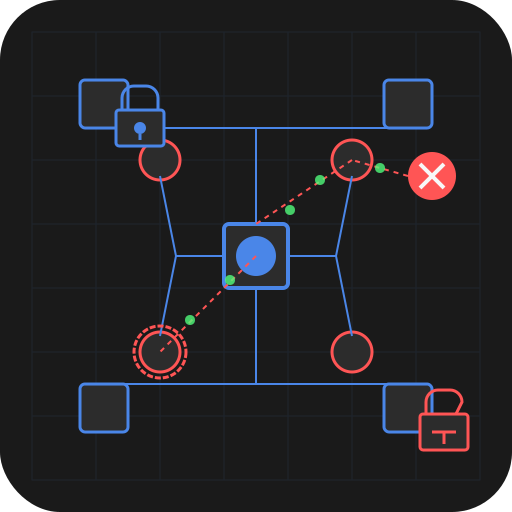
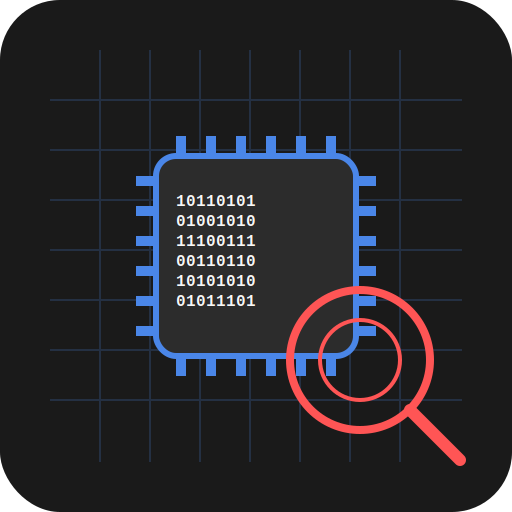

# GridNix

[](https://opensource.org/licenses/MIT)
[](https://www.oshwa.org)
[](https://github.com/HexGuard-Security/GridNix/releases)
[](https://github.com/HexGuard-Security)
[]()

A reproducible NixOS-based operating system for industrial control systems (ICS/SCADA) security research and assessment.

<div align="left">
  
  
  
  
</div>


> **PRE-RELEASE STATUS**: GridNix is currently in alpha development stage. We're actively looking for testers to help identify issues and provide feedback. See the [Testing](#become-a-tester) section to get involved!

## Overview

GridNix is a specialized NixOS distribution designed for security researchers, penetration testers, and engineers who work with industrial control systems (ICS), SCADA networks, PLCs, and critical infrastructure. It provides a declarative, reproducible environment with pre-configured tools for protocol analysis, device emulation, vulnerability assessment, and hardware interaction.

Trying to solve a major problem with other ICS/SCADA security distributions: the lack of updates/integration with new security tools. Security is a constantly evolving field, and we believe in having cutting-edge tools right at our fingertips, especially for critical infrastructure protection!

## Key Features

- **Reproducible Environments**: Built on NixOS with Nix Flakes for consistent, declarative configurations
- **Atomic Updates**: Safe system upgrades with rollback capability, essential for reliable testing environments
- **Real-time Kernel**: Low-latency kernel tweaks for precise timing in industrial protocols
- **Pre-configured Hardware Support**: Ready-to-use drivers and udev rules for industrial hardware interfaces (RS-485, CAN, etc.)
- **Specialized Tooling**: Curated collection of tools for ICS/SCADA security research
- **Community-Driven**: Open to contributions and tool suggestions

## Tool Categories

### Protocol Analysis
<div align="left">
  
  
  
  
</div>

| Tool | Description |
|------|-------------|
| plcscan | PLC detection and scanning tool |
| modbuspal | Modbus protocol simulator and tester |
| snort3 | Network intrusion detection with ICS-specific rules |
| pymodbus | Python Modbus protocol implementation |
| Wireshark | Network protocol analyzer with industrial protocol dissectors |
| Nmap | Network discovery with industrial protocol scripts |
| libiec61850 | IEC 61850 protocol library and tools |
| pcapsipdump | SIP/VoIP capture tool for industrial VoIP systems |

### Exploitation & Assessment
<div align="left">
  
  
</div>

| Tool | Description |
|------|-------------|
| ISF | Industrial Exploitation Framework |
| s7scan | Siemens S7 protocol scanner |
| codesys-vulnerability-scanner | Scanner for CODESYS-based controllers |
| Metasploit | Penetration testing framework with ICS modules |
| RouterSploit | Framework for embedded device exploitation |
| cve-bin-tool | SCADA firmware CVE scanning utility |
| Bettercap | Swiss-army knife for network attacks and monitoring |
| redfang | Bluetooth scanning for industrial control systems |

### Simulation & Emulation
<div align="left">
  
  
  
</div>

| Tool | Description |
|------|-------------|
| pyHMI | Human-Machine Interface prototyping tool |
| gridlab-d | Power grid simulation framework |
| QEMU | Open source machine emulator for PLC firmware |
| OpenPLC | Open source PLC runtime |
| EtherSim | Ethernet/IP protocol simulator |
| MinimalModbus | Python library for Modbus RTU/ASCII |
| GRSim | Grid resilience simulation toolkit |
| ICSim | Industrial Control System Simulator |

### Hardware Interfaces
<div align="left">
  
  
</div>

| Tool | Description |
|------|-------------|
| can-utils | Linux CAN bus utilities |
| kvaser_linux | Kvaser CAN interface drivers |
| OpenOCD | On-chip debugging for industrial controllers |
| Sigrok | Signal analysis for industrial protocols |
| I2C-tools | Utilities for I2C bus communication |
| SPI-tools | Utilities for SPI bus communication |
| Flashrom | Universal ROM/flash chip programmer for PLCs |
| Bus Pirate | Hardware tool for industrial bus communication |

### Firmware Analysis
<div align="left">
</div>

| Tool | Description |
|------|-------------|
| Binwalk | Firmware analysis and extraction tool |
| Ghidra | NSA's software reverse engineering framework |
| Radare2 | Advanced hexadecimal editor, disassembler, and debugger |
| Rizin | UNIX-like reverse engineering framework |
| GDB-Multitarget | GNU debugger with multi-architecture support |
| Firmware-mod-kit | Tools to extract, modify and rebuild industrial firmware |
| IDA Free | Interactive disassembler (free version) |
| Unicorn | CPU emulator framework for industrial controllers |

### Utilities
<div align="left">
  
  
</div>

| Tool | Description |
|------|-------------|
| Python3 | Programming language with libraries for ICS security |
| Wireshark | Network protocol analyzer with industrial dissectors |
| Sigrok | Signal analysis software suite |
| Git | Version control system |
| VSCode | Code editor with extensions for industrial protocols |
| Docker | Container platform for isolated testing |
| OpenSSH | Remote access and file transfer tools |
| Tmux | Terminal multiplexer for managing multiple console sessions |

## Getting Started

### Quick Start

To build and use GridNix:

1. Clone the repository:
   ```bash
   git clone https://github.com/HexGuard-Security/GridNix.git
   cd GridNix
   ```

2. Build the ISO using the build script:
   ```bash
   ./build.sh
   ```

3. Flash the ISO to a USB drive:
   ```bash
   sudo dd if=build/GridNix-0.1.0-alpha-x86_64_linux.iso of=/dev/sdX bs=4M status=progress
   ```

4. Boot from the USB drive and start your ICS security research!

### System Requirements

- **Minimal**: 2GB RAM, dual-core CPU, 20GB storage
- **Recommended**: 8GB+ RAM, quad-core CPU, 50GB+ SSD, compatible industrial hardware interfaces

### Supported Architectures

- x86_64 (primary)
- aarch64 (experimental)

## Building the ISO

GridNix uses Nix Flakes to create reproducible builds. The build process varies depending on your host system:

### On Linux

If you're running Linux, you can build GridNix directly:

```bash
# Make sure you have Nix installed with flakes enabled
nix-shell -p nixos-generators git

# Clone and build
git clone https://github.com/HexGuard-Security/GridNix.git
cd GridNix
./build.sh
```

### On macOS

Building NixOS-based systems on macOS requires additional steps. We've provided detailed instructions in [docs/BUILD-ON-MAC.md](docs/BUILD-ON-MAC.md).

In short, you'll need to:
1. Set up a Linux VM or container environment
2. Build the ISO inside that environment
3. Transfer the ISO back to your host system

### On Windows

Building on Windows requires WSL2 (Windows Subsystem for Linux) with a Linux distribution that supports Nix. Follow the Linux instructions after setting up your WSL environment.

## Become a Tester

**We need your help!** GridNix is currently in alpha and we're looking for testers to help improve it before the official release. As a tester, you'll:

- Build and try out pre-release versions of GridNix
- Test compatibility with various industrial hardware devices
- Report bugs and provide feedback
- Help improve documentation
- Suggest features and improvements

**To become a tester:**

1. Star and watch this repository for updates
2. Join our [Discord server](https://discord.gg/j2fFUYT8h7) to connect with other testers
3. Check the [Issues](https://github.com/HexGuard-Security/GridNix/issues) page for known issues and testing tasks
4. Report your findings by creating new issues with the "testing" label

We particularly need testers with:
- Various industrial hardware interfaces (RS-485, CAN, etc.)
- PLCs and SCADA systems
- JTAG/SWD debugging hardware
- Industrial fieldbus adapters

## Community & Design Contributions

GridNix features a growing collection of custom assets including icons, wallpapers, and themes:

<div align="center">
  
  
  
  
</div>

<div align="center">
  
</div>
<div align="center">
  
</div>
<div align="center">
  
</div>
<div align="center">
  
</div>
<div align="center">
  
</div>

### We're Looking for Design Contributors!

Are you skilled with:
- Vector graphics design (SVG)
- Inkscape or other open-source design tools
- UI/UX design for Linux environments
- GNU/Linux theming

Join our community and help shape the visual identity of GridNix! We welcome contributions for:
- Additional wallpapers
- Tool-specific icons
- UI theme improvements
- Logo variations
- Documentation illustrations

See our [contribution guidelines](CONTRIBUTING.md) to get started or join our [Discord community](https://discord.gg/j2fFUYT8h7).

## Customization

GridNix is designed to be easily customizable. See [CUSTOMIZATION.md](docs/CUSTOMIZATION.md) for details on how to:

- Add your own tools and packages
- Customize the desktop environment
- Configure hardware support
- Create custom modules

## Tool Inventory

GridNix comes with a comprehensive suite of pre-installed security tools. For a complete list, see [TOOLS.md](docs/TOOLS.md).

If you need a tool that isn't included, check our documentation on [adding custom packages](docs/custom-packages.md).

## Hardware Compatibility

GridNix is designed to work with common industrial hardware interfaces:

- RS-485
- CAN bus
- JTAG/SWD debugging hardware
- Industrial fieldbus adapters
- Modbus RTU converters
- PROFINET/PROFIBUS interfaces

See [HARDWARE.md](docs/HARDWARE.md) for detailed compatibility information.

## Building

```bash
# Clone the repository
git clone https://github.com/HexGuard-Security/GridNix.git
cd GridNix

# Build a minimal ISO with the current config
./build.sh
```

For more advanced build options:

```bash
# Build for a specific architecture
./build.sh --arch aarch64-linux

# Clean before building
./build.sh --clean

# Get help on build options
./build.sh --help
```

## Contributing

GridNix welcomes contributions! Please feel free to submit issues or pull requests for:

- Adding new tools to the distribution
- Creating Nix packages for tools not currently in nixpkgs
- Improving hardware compatibility
- Developing automation scripts for common tasks
- Documentation improvements

For tools not available in nixpkgs or issues with current packages, please submit an issue on GitHub.

## Roadmap

- Complete base configuration
- Package missing industrial tools
- Test industrial hardware compatibility
- Create automation scripts for common ICS security tasks
- Implement kernel tweaks for real-time protocol handling
- Add additional fieldbus protocol support
- Release first ISO image

## Contact & Community

- Website: [hexguard.net](https://hexguard.net)
- GitHub: [HexGuard-Security/GridNix](https://github.com/HexGuard-Security/GridNix)
- Discord: [Join our community](https://discord.gg/j2fFUYT8h7)
- Twitter: [@HexGuardSec](https://twitter.com/HexGuardSec)

## License

GridNix is released under the [MIT License](LICENSE).

---

<div align="center">
  <p>Developed and maintained by <a href="https://hexguard.net">HexGuard Security</a></p>
</div>
